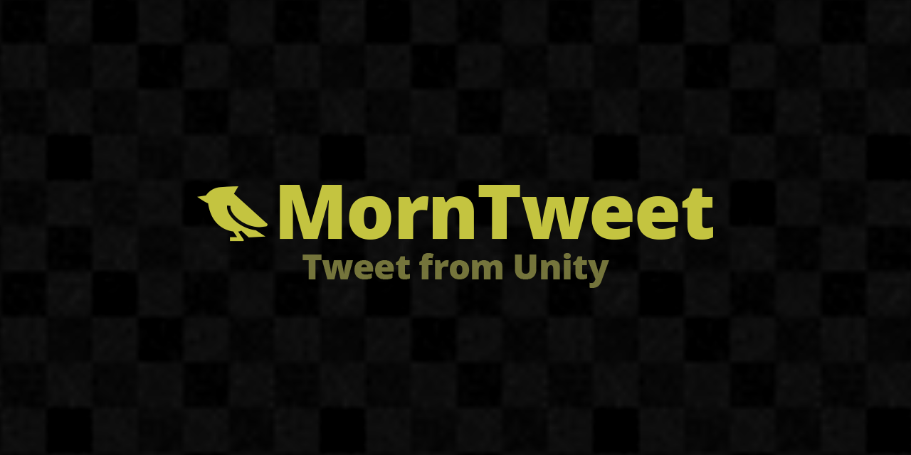

# MornTweet

<p align="center">
  
</p>

<p align="center">
  
</p>

## 概要

Unity ゲームから Twitter/X にツイートするユーティリティです。
テキストのみ、またはスクリーンショット付き (imgBB 経由) で投稿できます。
外部パッケージへの依存はありません。

## 導入方法

Unity Package Manager で以下の Git URL を追加:

```
https://github.com/TsukumiStudio/MornTweet.git
```

`Window > Package Manager > + > Add package from git URL...` に貼り付けてください。

### スクリーンショット付きツイートを使う場合

[imgBB](https://imgbb.com/) でアカウントを作成し、[API ページ](https://api.imgbb.com/) から API Key を取得してください。

## 使い方

### コンポーネントから使う

`MornTweetButton` を Button にアタッチし、Inspector で設定:

| プロパティ | 説明 |
|---|---|
| **Tweet Text** | ツイート本文 |
| **Hashtags** | ハッシュタグ (配列、#不要) |
| **Include Screenshot** | スクリーンショットを添付するか |
| **Api Key** | imgBB の API Key (スクリーンショット使用時のみ) |

### スクリプトから使う

```csharp
using MornLib;

// テキストのみ
MornTweetService.Tweet("ゲームをプレイしました！", "MyGame,Unity");

// スクリーンショット付き (コルーチン)
StartCoroutine(MornTweetService.TweetWithScreenShotCoroutine(
    "ゲームをプレイしました！", "MyGame,Unity", "your_api_key"
));
```

## 注意事項

- imgBB は外部サービスです。サービスの停止・仕様変更・レート制限等について、本ライブラリの作者は一切の責任を負いません

## ライセンス

[The Unlicense](LICENSE)
